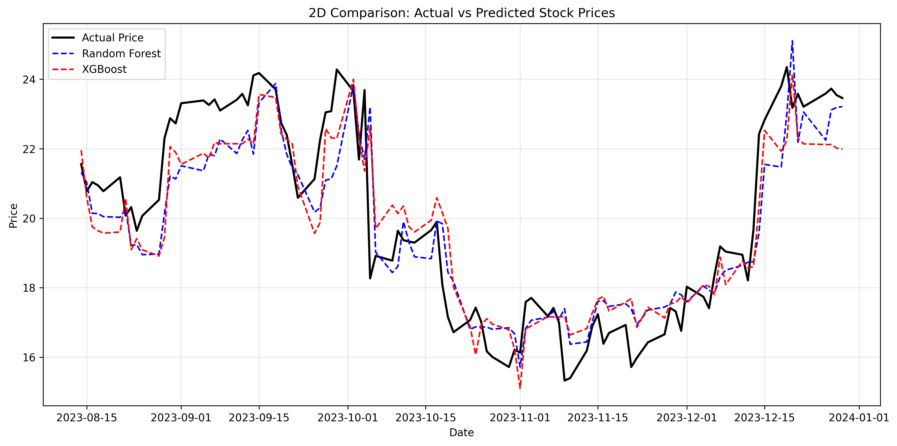
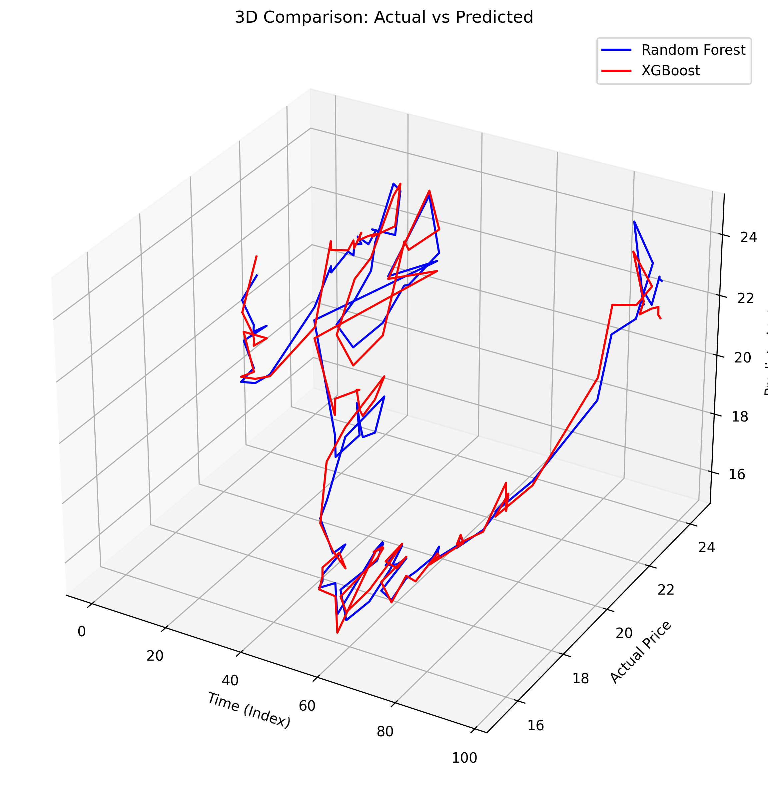

# 🚀 AlphaForge-ML-Stock-Predictor

A complete ML pipeline that predicts next-day stock prices and visualizes the predictions — powered by AlphaForge.

---

## 📌 Project Highlights
✅ Data fetched from Yahoo Finance (Rivian Automotive - RIVN stock)  
✅ Feature Engineering: Moving Averages, Volatility, Lag Features  
✅ Machine Learning Models: Random Forest Regressor, XGBoost Regressor  
✅ Evaluation Metrics: RMSE, MAPE  
✅ 2D & 3D Visualizations of predictions  
✅ Results saved as images in the `results/` folder

---

## 📚 Dataset
- **Ticker Used:** RIVN (Rivian Automotive)
- **Timeframe:** 2022 - 2024
- **Features Created:** MA5, MA10, MA20, Volatility, Close Lags (1 to 5 days)

---

## 🧠 Machine Learning Models Used
| Model           | Description                                        |
|-----------------|----------------------------------------------------|
| Random Forest   | Captures non-linear relationships                  |
| XGBoost         | Gradient Boosted Trees for robust performance      |

---

## 📊 Model Performance (Example Metrics)
| Model           | RMSE   | MAPE   |
|-----------------|--------|--------|
| Random Forest   | 1.23   | 4.71%  |
| XGBoost         | 1.24   | 5.04%  |

---

## 🖼️ Visualizations
### 📈 2D Predictions

### 📊 3D Predictions

---

🙌 Author
Built by NIRAJ — Connect with me on LinkedIn

📜 License
This project is open-source and available under the MIT License.

